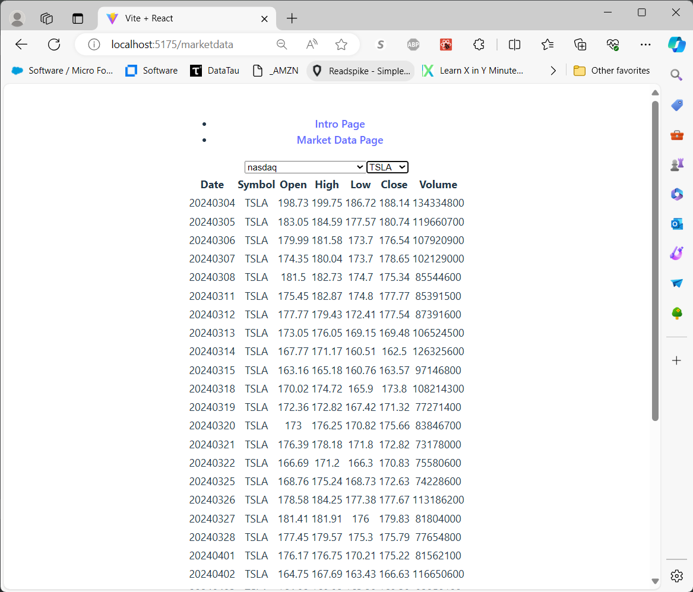

# EOD Service UI for Browsing Historical Stock Market OHLCV Data

## Description:
- A very simple [React](https://react.dev/) front end for [EOD Service](https://github.com/mring33621/eod-service) REST API.
- Uses the [Vite](https://vitejs.dev/) 'React' template
- Uses [react-router-dom](https://reactrouter.com/en/main) for routing between multiple 'pages'
- Uses Vite's built-in proxy to forward requests to the EOD Service API, avoiding CORS issues, in local/dev mode
- I built this in order to learn a bit about React and Vite

## TODO:
- [ ] Add some styling
- [ ] Add some graphs
- [ ] Add a 'Symbol Search' component
